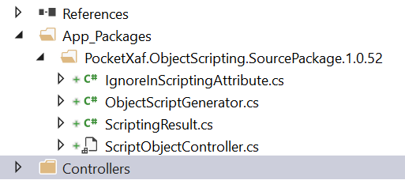
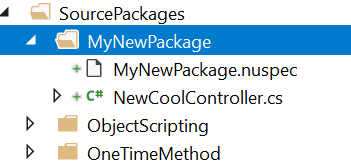

[](https://dev.azure.com/eXpandDevOps/eXpandFramework/_build/latest?definitionId=13)
[](https://github.com/eXpandFramework/xaf/stargazers)
[](https://github.com/eXpandFramework/xaf/issues)
[](https://github.com/eXpandFramework/xaf/network)


# Introduction

We started this project, because we want provide compact and low dependency components for the XAF framework. 

Usually creating packages for the the DevExpress .Net components comes with a necessity  to update the packages every time DevExpress publishes a new release, at least a major one. Because of the, we decided to provide our components not a .dlls, but as source code Nuget packages. A source code Nuget package simply installs source code into Your project underneath the App_Packages folder. On a package update, old source files will be deleted and new installed. 

This way of packaging allows us not to deal with different DevExpress versions, since breaking changes are quite rare in the DevExpress libraries. Also source code packages can be installed by users, how using self-compiled  DevExpress libraries.

This approach make also contribution much easier. Potential contributors don't have to compile the packages locally, they can simply change the source code in their projects and then copy it to their forks and provide us pull requests. 

## How this works

Nuget source code packages are installed as every other nuget package:

```Powershell
Install-Package PocketXaf.ObjectScripting.SourcePackage
```

The package is installed in the App_Packages folder:




# Project structure

Under the `src` folder we have 2 subfolders: `Libraries` and `TestApplication`. The `Libraries` folder contains the source code for the packages. The `Testapplication` folder contains a XAF application for testing purposes.

## Libraries folder

The libraries folder contains 2 subfolders: `PlatformAgnostic` and `Win`. PlatformAgnostic contains platform independent code. And Win folder contains WinForma specific code. We don't have any web components yet. Each of these folders contains a "SourcePackages" folder. This is where the source code for the packages is located. Each packages has it own folder, which contains the source code and the .nuspec file.

# How to create a package

1. Create a new folder inside the SourcePackages folder.

2. Copy .nuspec file from another package e.g ObjectScripting.

2. Change the package Id:

```XML
<package>
  <metadata>
    <id>PocketXaf.MyNewPackage.SourcePackage</id>
```

3. Change the destination folder:
```XML
  <files>
    <file src="*.cs" target="content\App_Packages\PocketXaf.MyNewPackage.SourcePackage.$version$" />
```

4. Add your source files to the project inside this folder:

  
Now the build script will automatically build Your package. 


# Building packages

To build packages type following command in the `src` folder:
```Powershell
msbuild build.proj /t:NuGet
```

